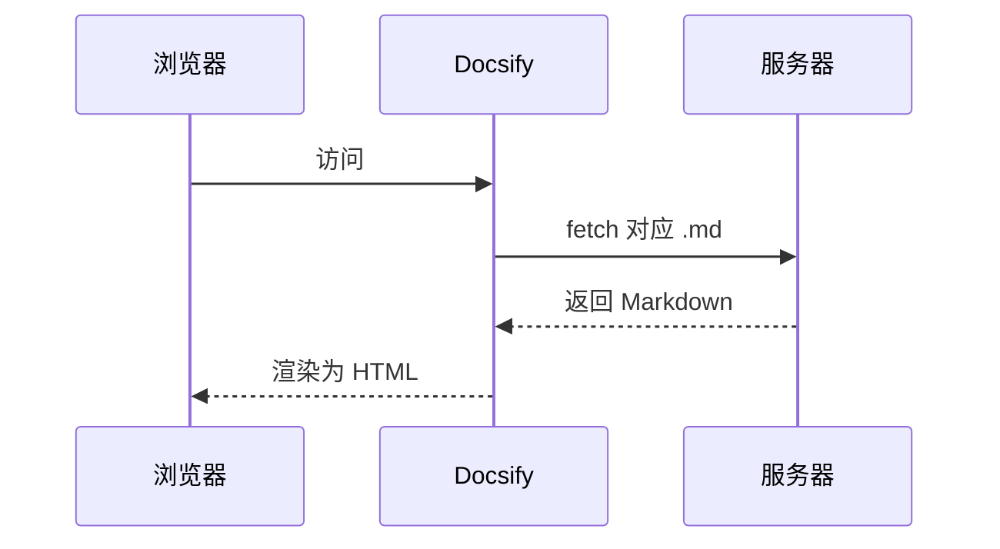

# 附录 · 图表与公式

演示两个「加分」能力：Mermaid 流程图和 KaTeX 公式。不需要的话删掉本页，并从 `_sidebar.md` 移除对应链接即可。

## Mermaid 流程图

下面这个图由一个 ` ```mermaid ` 代码块渲染而来：


再来一个时序图：



## KaTeX 数学公式

行内公式：质能方程 $E = mc^2$，欧拉恒等式 $e^{i\pi} + 1 = 0$。

块级公式：

$$
\frac{\partial \mathcal{L}}{\partial w} \;=\; \frac{1}{N}\sum_{i=1}^{N}\left(\hat{y}_i - y_i\right)x_i
$$

## 图片放大

任意 `` 插入的图片，点击即可缩放（zoom-image 插件）。

---

返回 [首页](/)
